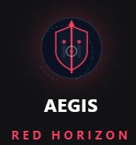

#  AEGIS: MANUAL DE OPERACIONES Y DOCTRINA

Clasificación: USO INTERNO / AUDITORES AUTORIZADOS

Arquitecto: César Matute (Auditor)

Sistema: Red Horizon C2 Intelligence Core

## 1. GÉNESIS: El Ecosistema AEGIS y la Doctrina Operativa

En el panorama actual de la ciberseguridad, los equipos de Red Team a menudo se encuentran saturados gestionando decenas de herramientas desconectadas, perdiendo tiempo valioso en la sintaxis técnica en lugar de centrarse en la estrategia del ataque.

Para solucionar esto, nace AEGIS. Un ecosistema unificado de ciberseguridad que abarca el ciclo completo de una auditoría y gestión de riesgos:

AEGIS: Governance (GRC): La herramienta de trabajo diario del equipo auditor para llevar auditorías de cumplimiento multinorma de principio a fin — no solo ISO 27001, sino ISO 9001/14001/45001/42001 (IA), ENS, NIS2, DORA, RGPD/LOPDGDD, PCI DSS y sostenibilidad/huella de carbono (ISO 14064), activando únicamente las normativas que aplican a cada cliente. Se sube evidencia técnica real (PDF, DOCX, XLSX, reportes Nmap/Nessus/OpenVAS, hasta 100 MB por archivo), un motor de IA dual (Gemini en la nube u Ollama 100% local, sin salir de la máquina del auditor) la mapea al control correspondiente, y desde ahí el hallazgo recorre su propio ciclo — revisión, valoración de riesgo (MAGERIT v3 o NIST SP 800-30 según la región del cliente), exportación del entregable formal (SOA, Matriz de Riesgos ISO 31000, BIA, tablero Scrum multinorma). Es una herramienta interna de la auditoría, sin registro público ni acceso de cliente, multi-tenant aislado por proyecto en PostgreSQL, y con Zero Data Retention en Gemini para cumplir el EU AI Act - Reglamento 2024/1689: Nos amparamos en el Artículo 10 (Gobernanza de Datos) y el Artículo 13 (Transparencia). La plataforma informa claramente al usuario de que interactúa con un sistema de IA y garantiza que los datos se manejan bajo estrictos estándares de calidad y privacidad, sin sesgos. | Privacidad (RGPD - Artículo 28): Al conectarnos mediante API de pago (Enterprise) y no mediante la interfaz web gratuita, los proveedores (como Google Gemini) actúan legalmente como 'Encargados del Tratamiento' bajo el Artículo 28 del RGPD. Firman un DPA (Data Processing Agreement) de Zero Data Retention, lo que garantiza por contrato que los datos se procesan en la memoria RAM del servidor y se destruyen inmediatamente, con prohibición legal y técnica de usarlos para entrenar sus propios modelos..

AEGIS: Vanguard Core: Plataforma de monitorización y defensa activa que actúa como puente táctico-GRC, traduciendo hallazgos técnicos en métricas de impacto financiero y desviación normativa para que la Alta Dirección (C-Level) tome decisiones basadas en inteligencia de amenazas en tiempo real. Organizada en 19 paneles con lógica de negocio y persistencia real (nada simulado): Panel Ejecutivo con KPIs de C-Level, Matriz GRC (generador automático de SOA sobre 41 marcos normativos en la región Europa), Riesgo de Terceros (TPRM), Impacto Financiero (BIA), Continuidad BCP/DRP, Inventario TI (CMDB) con autodescubrimiento de activos vía agente propio o escaneo agentless, Vulnerabilidades enlazadas al CMDB con SLA configurable por normativa, Seguridad Cloud (CSPM), Ingesta Técnica multiformato (Nessus, OpenVAS, Wazuh, Burp, EDR, Trivy, ZAP, SARIF...), Ciber Inteligencia (OSINT) con correlación MITRE ATT&CK/OWASP, SOC (SIEM) con Live Feed en tiempo real, SOAR, Caza de Amenazas, Dark Web/OSINT, Laboratorio Forense (DFIR), DevSecOps, Concienciación (riesgo humano) y ESG/RRHH. Comparte el mismo motor de IA dual (Gemini/Ollama) y la misma filosofía de soberanía de datos que el resto del ecosistema AEGIS.

AEGIS: Red Horizon: El Cerebro Ofensivo C2 (Command & Control) asistido por IA para operaciones de Red Teaming y Ciberinteligencia.

Red Horizon no fue creada para reemplazar al operador humano, sino para actuar como un Multiplicador de Fuerza. Es el núcleo de inteligencia dual (Google Gemini 3.7 en la nube, u Ollama en local sin censura) que orquesta las manos del auditor, garantizando la agilidad en las 5 fases metodológicas del Pentesting:

Reconocimiento: OSINT y mapeo de superficie.

Escaneo y Enumeración: Identificación de puertos, servicios y vulnerabilidades.

Explotación: Acceso inicial y compromiso.

Post-Explotación y Borrado de Huellas: Escalada de privilegios, persistencia y eliminación de rastros.

Reporte (Reporting & DFIR): Análisis forense y evidencias.

## 2. DECODIFICANDO LA IDENTIDAD VISUAL

El logo de Red Horizon fusiona la herencia de la familia AEGIS con la agresividad de las operaciones ofensivas.

🛡️ El Escudo Robusto Central: Representa la herencia de AEGIS Vanguard Core y AEGIS Governance. El control absoluto de la información.

📡 El Parche Táctico y Nodos: El fondo oscuro y segmentado simboliza la cartografía de la red (Recon) y la infraestructura de los Command & Control modernos.

🔻 La Flecha Perforante (Red Horizon): Una línea roja que atraviesa el escudo de abajo hacia arriba. Representa el "Red Team": encontrar la vulnerabilidad, romper el perímetro y penetrar en la infraestructura del objetivo.

## 3. MANUAL DE USO OPERATIVO Y OPSEC

🚀 Fase 1: Despliegue y Seguridad Operativa (OPSEC)
Red Horizon opera bajo estrictos estándares de seguridad. Ninguna API Key toca jamás el navegador: viven exclusivamente en el AI Gateway (backend Express) que corre junto al frontend.

Crea un archivo `.env` en la raíz del proyecto.

Inyecta las credenciales que vayas a usar:

- `GEMINI_API_KEY=tu_clave_aqui` (motor CLOUD)
- `OLLAMA_BASE_URL=http://127.0.0.1:11434` y `OLLAMA_MODEL=dolphin3` (motor LOCAL, sin censura)
- `AEGIS_PORT=1337` (opcional) — puerto del frontend. Cámbialo si tu SO lo tiene reservado (en Windows con Hyper-V/WSL2/Docker es habitual; el síntoma es `listen EACCES: permission denied 0.0.0.0:1337` al arrancar). Lo respetan los scripts, Vite y Docker por igual.

Despliega la plataforma (start_aegis.bat en Windows, o start_aegis.sh en Linux/macOS). El sistema se levantará en el puerto táctico TCP/1337 (frontend, configurable vía `AEGIS_PORT`), con el AI Gateway detrás en el puerto 4000 durante desarrollo.

🧠 Fase 1.5: Doctrina Cloud vs Local
AEGIS opera con dos núcleos de IA intercambiables en caliente desde el panel OPSEC:

- ☁️ CLOUD (Gemini 3.7): máxima capacidad y velocidad. Úsalo en CTFs y entornos sin restricción contractual de datos.
- 🖥️ LOCAL (Ollama, sin censura): todo el razonamiento ocurre en tu propia GPU, sin salir de tu red. Es el modo doctrinal correcto para auditorías reales bajo NDA, donde el target, los hallazgos y las credenciales del cliente NO pueden abandonar tu máquina. El modelo activo se configura vía OLLAMA_MODEL en .env — no requiere tocar código.

⚙️ Fase 2: El Panel de Control y el Botón del Pánico
Al hacer clic en el engranaje de configuración ⚙️, accedes al panel OPSEC & SYSTEM:

Conectividad del C2: Verifica en tiempo real el estado de AMBOS motores (Gemini y Ollama), con acceso directo para generar nuevas API Keys.

Motor de IA Activo: Selector CLOUD / LOCAL — cambia el núcleo de razonamiento de toda la plataforma al instante.

Idioma de la IA: ES/EN, aplicado a todas las respuestas del núcleo.

Cambio de Callsign: Cambia tu alias de operador al vuelo sin cerrar la sesión.

🚨 PANIC BUTTON: En caso de emergencia durante una auditoría o si el entorno está comprometido, pulsar este botón rojo purgará la caché, el historial de sesiones y recargará la plataforma dejándola completamente en blanco.

⚔️ Fase 3: Ciclo de Combate Multisesión (The Loop)
AEGIS opera con un sistema de Persistencia de Pestañas Paralelas. Puedes atacar múltiples frentes sin perder el hilo de pensamiento de la IA.

SELECCIÓN DE VECTOR: Elige una herramienta (ej. Nmap).

INICIALIZACIÓN Y ORDEN: Proporciona la IP del CTF o auditoría. La IA generará el comando de ejecución óptimo sin simulaciones.

EJECUCIÓN EN CAMPO: Copia el comando, ejecútalo en tu terminal real (Kali/Parrot) y pega la salida de vuelta en AEGIS.

MULTITASKING: Mientras Nmap escanea, abre "Ffuf" en el menú lateral. La plataforma abrirá una nueva sesión aislada para Ffuf. Puedes volver a Nmap en cualquier momento; la conversación estará exactamente donde la dejaste.

RESET: Utiliza el botón LIMPIAR (Icono de papelera) en la cabecera de la terminal para destruir el historial de esa herramienta específica e iniciar un nuevo escaneo desde cero.

VISTA DIVIDIDA: Si el multitasking por pestañas no alcanza, pulsa "VISTA DIVIDIDA" en la cabecera de cualquier terminal (o el botón del sidebar). Se abren 2-3 paneles simultáneos en pantalla, cada uno con su propio selector de módulo y su propia sesión de IA — enviar un mensaje en un panel NO bloquea el input de los otros mientras la IA responde. Un botón "+ AGREGAR PANEL" suma un tercero (máximo 3); "X SALIR" regresa a la vista normal de un solo panel sin perder nada de lo trabajado.

📄 Fase 4: Reporte y Evidencia
Acelera el proceso burocrático de la auditoría. Hay dos caminos, según de dónde venga la información:

CAMINO A — Desde una terminal: Haz clic en el botón "REPORTE" en cualquier terminal activa. La IA relee esa conversación y compila un Informe Profesional gerencial (Resumen Ejecutivo, hallazgos con severidad, remediación).

CAMINO B — Desde el Tablero de Hallazgos (recomendado si ya trackeaste hallazgos ahí): mueve cada hallazgo confirmado a la columna "Reportado" y pulsa "Generar Reporte" en el propio tablero. El informe se arma al instante desde esos hallazgos — sin volver a consultar a la IA — usando la descripción y remediación que ya documentaste por hallazgo.

En ambos casos se abre la misma modal de reporte: adjunta evidencia fotográfica por hallazgo (botón "Adjuntar / Pegar" — sube un archivo o pega una captura directo con Ctrl+V, con descripción editable), y exporta el documento final a PDF, Word o HTML.

📌 Fase 5: Tablero de Hallazgos
Accesible desde "HALLAZGOS" en el sidebar. Es un kanban de 3 columnas — Encontrado → Verificando → Reportado — para trackear manualmente los hallazgos de la auditoría en curso, separado del historial de chat con la IA.

REGISTRAR: escribe el título del hallazgo, elige su severidad (CRITICAL/HIGH/MEDIUM/LOW/INFO) y pulsa "Agregar". Entra en la columna "Encontrado".

DOCUMENTAR: haz clic en la flechita de cada tarjeta para expandirla y agregar la descripción técnica y la remediación — este es el contenido que terminará en el reporte final.

MOVER: usa las flechas ← → de cada tarjeta para avanzarla de columna a medida que la verificas y la vuelcas en el reporte.

Es tu lista de pendientes de la auditoría: qué hallazgos siguen sueltos vs. cuáles ya cerraste. Está aislado por engagement, igual que las sesiones de chat.

🔗 Fase 6: Recursos & OSINT
Accesible desde "RECURSOS & OSINT" en el sidebar. Un panel de 83 enlaces curados en 14 categorías — wikis de metodología (HackTricks, PayloadsAllTheThings, GTFOBins), calculadoras CVSS (NVD, FIRST, Beagle Security), MITRE ATT&CK/OWASP, bases de CVE/exploits, herramientas OSINT (personas, imágenes/reverse search, dominios/DNS), plataformas de práctica CTF, write-ups de máquinas retiradas, sandboxes de malware, y herramientas de cloud/mobile/wireless. Todos los enlaces abren en pestaña nueva y hay un buscador arriba para filtrar por nombre, categoría o descripción. Cero dependencia de la IA — acceso directo cuando ya sabes qué necesitas.

🔍 Fase 7: Búsqueda Global (Ctrl+K)
Pulsa Ctrl+K (o Cmd+K en macOS) desde cualquier pantalla, o el botón "BUSCAR" del sidebar. Indexa el contenido de TODAS las sesiones de chat de TODOS tus engagements y módulos — escribe al menos 2 caracteres y verás cada mensaje que contenga esa coincidencia, con el engagement y módulo de origen, resaltado en el texto. Haz clic en un resultado y AEGIS te lleva directo a esa conversación. Pensado para cuando ya acumulaste varios engagements y no recuerdas en cuál mencionaste un CVE, una IP o un usuario específico.

🗂️ Fase 8: Workspaces por Engagement
Cada auditoría/CTF real debería vivir en su propio "engagement" — el selector está justo debajo del reloj en el sidebar (ícono de maletín).

CREAR: escribe un nombre (ej. "Cliente ACME — Pentest Externo" o "HTB - Forest") en el campo del desplegable y pulsa "+". El nuevo engagement queda activo de inmediato.

CAMBIAR: haz clic en cualquier engagement de la lista para activarlo — todas las sesiones, el tablero de hallazgos y la vista dividida cambian a su contexto, sin mezclar nada del engagement anterior.

EXPORTAR / IMPORTAR: cada fila del desplegable tiene un ícono de descarga que baja un `.json` con todo el historial y hallazgos de ese engagement — úsalo como backup o para entregárselo a un cliente. El botón "Importar engagement (JSON)" al pie del desplegable restaura ese archivo como un engagement nuevo (nunca pisa uno existente), incluso en otra máquina.

🔐 Fase 9: Cifrado del Almacenamiento Local (Opcional)
Por defecto, las sesiones, engagements y hallazgos viven en texto plano en el `localStorage` de tu navegador — suficiente para CTFs casuales. Para engagements reales bajo NDA, activa el cifrado desde el panel OPSEC & SYSTEM (sección "Cifrado del Almacenamiento Local"):

ACTIVAR: define una passphrase (mínimo 8 caracteres) y confírmala. A partir de ahí, tus datos se cifran con AES-256-GCM (clave derivada vía PBKDF2, 250.000 iteraciones) antes de tocar el disco.

CADA CARGA DE LA APP te pedirá esa passphrase en una pantalla de desbloqueo antes de mostrar nada — sin ella, los datos son ilegibles.

SI OLVIDAS LA PASSPHRASE no hay recuperación posible (es cifrado real, no un truco): en la pantalla de desbloqueo, "¿Olvidaste tu passphrase? Borrar datos cifrados" te devuelve el acceso a la app borrando solo esos datos protegidos.

DESACTIVAR: vuelve al panel OPSEC y pulsa "DESACTIVAR CIFRADO" — tus datos actuales se vuelven a guardar en texto plano.

## 4. EL ARSENAL TÁCTICO

AEGIS Red Horizon cubre **62 módulos de IA especializados** en 11 categorías, cada uno con un system prompt propio calibrado a esa herramienta o metodología específica. Esto es lo que hace cada uno:

🎓 Metodología & Playbooks (11) — guías end-to-end fase por fase, confirmando en qué etapa estás antes de avanzar; la misma disciplina que evalúan las certificaciones, no solo comandos sueltos:

- AD Attack Path — cadena completa de compromiso de Active Directory: recon no autenticado → BloodHound → Kerberoasting/AS-REP Roasting → movimiento lateral (PtH/PtT) → DCSync. (OSCP · CRTP · CRTE)
- Pivoting & Tunneling — SSH, Chisel, Ligolo-ng, sshuttle, proxychains y doble/triple pivote entre redes segmentadas. (OSCP · CRTO)
- Web & API Methodology — recon → auth/sesión → inyección → OWASP API Top 10 → lógica de negocio, mapeado a CVSS. (OSWE · eWPT · CPTS · BSCP)
- Privilege Escalation — checklist sistemática Linux (LinPEAS, SUID, cron) y Windows (WinPEAS, SeImpersonate, servicios). (OSCP · eCPPT · PNPT)
- Buffer Overflow & Exploit Dev — fuzzing → control de EIP/RIP → bad chars → shellcode → exploit final, el proceso clásico de examen. (OSCP · OSED)
- Red Team Ops & C2/Evasion — infraestructura, perfiles Malleable C2, evasión AV/EDR y OPSEC de movimiento lateral. (CRTO · OSEP)
- Mobile Pentesting — análisis estático/dinámico mapeado a categorías OWASP MASVS. (eMAPT)
- Cloud Security (AWS/Azure) — recon no autenticado, enumeración IAM, rutas de privesc en la nube. (MITRE ATT&CK Cloud)
- Wireless Pentesting — monitor mode, captura de handshake/PMKID, cracking offline, ataques WPS. (OSWP)
- OSINT & Recon Estructurado — construye el mapa de superficie de ataque completo antes de tocar nada activamente. (eJPT · CPTS · CEH)
- Redacción de Informes — estructura de reporte grado examen: resumen ejecutivo, CVSS, pasos de reproducción, remediación. (OSCP · CREST · CPTS)

🕵️ Inteligencia & OSINT (6):

- theHarvester — correos, subdominios y nombres de empleados desde fuentes públicas (motores de búsqueda, PGP, Shodan, crt.sh).
- Sherlock — búsqueda de un username a través de cientos de redes sociales y plataformas.
- Maltego — transforms y grafos de relación para correlacionar entidades (personas, dominios, infraestructura).
- Recon-ng — framework modular de OSINT con workspaces, módulos de reconocimiento y harvesting a base de datos.
- MISP Intel — threat intelligence, análisis de IOCs y mapeo a MITRE ATT&CK.
- Doxing & Leaks — búsqueda segura en HaveIBeenPwned/DeHashed y análisis de bases de datos filtradas.

🎯 Recon & Bug Bounty (7):

- Netdiscover / ARP-Scan — descubrimiento de hosts vivos en la red **antes** de escanear puertos (ARP pasivo vs. sweeps ICMP/TCP).
- Nmap — escaneo de puertos y servicios, scripts NSE, evasión de firewalls, análisis de output XML/grepable.
- Masscan — escaneo asíncrono de altísima velocidad para subredes grandes.
- Subfinder / Amass — enumeración masiva de subdominios y descubrimiento de wildcards.
- Httpx — sondeo de activos web vivos: títulos, status codes, stack tecnológico.
- Nuclei — escaneo de vulnerabilidades por templates, clasificación rápida de CVEs.
- Nessus / OpenVAS — escaneo autenticado de infraestructura y priorización de hallazgos críticos.

☁️ Cloud Security (2):

- AWS Pacu — enumeración de S3, privesc de IAM, abuso de Lambda y metadata de EC2.
- AzureHound — enumeración de Azure AD, Service Principals y bypass de Conditional Access.

📱 Mobile Hacking (2):

- MobSF — análisis estático: decompilación, revisión de manifest, secretos hardcodeados.
- Frida / Objection — hooking en runtime, bypass de SSL pinning y de detección de root/jailbreak.

🛠️ Desarrollo de Recursos & C2 (7):

- Cobalt Strike — perfiles Malleable C2, generación de Beacons, movimiento lateral (psexec/wmi).
- Sliver C2 — implantes multi-protocolo (mTLS/DNS/WireGuard) y post-explotación.
- Havoc C2 — framework moderno con payloads Demon, sleep obfuscation e indirect syscalls.
- PowerShell Empire — C2 open source clásico de PowerShell tradecraft, listeners y módulos de post-explotación.
- MSFVenom / Villain — generación de payloads y evasión de AV.
- SET Toolkit — spear-phishing, USBs maliciosos y harvesting de credenciales.
- GoPhish — campañas de phishing, clonado de landing pages y tracking.

🌐 Ataques Web (8):

- Burp / Caido — interceptación de tráfico, Repeater, Intruder, manipulación de WebSockets.
- WhatWeb / cURL / Wget — fingerprinting de servidores, extracción de headers, descarga de código fuente.
- Nikto — escaneo de software desactualizado y vulnerabilidades CGI en servidores web.
- Gobuster / Ffuf / DirBuster — fuerza bruta de directorios/archivos y descubrimiento de vhosts.
- SQLmap — inyección SQL avanzada: --dbs, --os-shell, bypass de WAF con --tamper.
- Commix — detección y explotación automatizada de Command Injection.
- WPScan / CMS — enumeración de usuarios, plugins y temas en WordPress/Joomla/Droopal.
- OWASP ZAP — escaneo automatizado, scans autenticados y fuzzing de APIs.

🔓 Acceso Inicial (8):

- Metasploit Framework — exploits, payloads, gestión de sesiones y pivoting.
- Evil-WinRM — shell de Windows Remote Management con credenciales válidas o pass-the-hash.
- Responder — envenenamiento LLMNR/NBT-NS para capturar hashes NTLMv2 en la red local.
- Hydra / Hashcat / John — fuerza bruta online y cracking offline con rainbow tables.
- Wifite 2 — auditoría WiFi automatizada de extremo a extremo.
- Bettercap — MITM, ataques BLE y WiFi en un solo framework.
- Kismet — sniffer pasivo de redes inalámbricas.
- Aircrack-ng — suite manual clásica de auditoría WiFi (captura, inyección, cracking).

🚩 Post-Explotación (6):

- LinPEAS / WinPEAS — triage automatizado de vectores de escalada de privilegios.
- Bloodhound / Impacket — mapeo de rutas de ataque en Active Directory y ejecución remota (psexec/wmiexec).
- Rubeus — ejecución práctica del abuso de Kerberos: roasting, Pass-the-Ticket, Golden/Silver Ticket.
- CrackMapExec — spray de credenciales SMB y enumeración masiva de red (NetExec).
- Mimikatz — extracción de credenciales en memoria (sekurlsa::logonpasswords y afines).
- Persistencia — backdoors, tareas programadas y mecanismos de persistencia post-compromiso.

🔍 Forense & DFIR (4):

- Autopsy — análisis de artefactos de disco y timeline forense.
- Volatility 3 — análisis de memoria RAM (procesos, inyecciones, credenciales en memoria).
- Wireshark — análisis de PCAP, descifrado de TLS, detección de beaconing C2.
- Ghidra — ingeniería inversa de binarios y análisis estático de malware antes de cualquier detonación dinámica.

📊 Reporting (1):

- Report Builder — el generador de informes accesible desde cualquier terminal (ver Fase 4).

*Fin del documento. Operar con precaución.*

   
  <h3>🕸️ <i>Y recuerda: ¡"Un gran poder conlleva una gran responsabilidad"!</i> 🕸️</h3>
   

