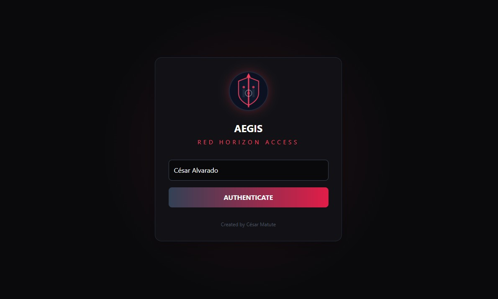
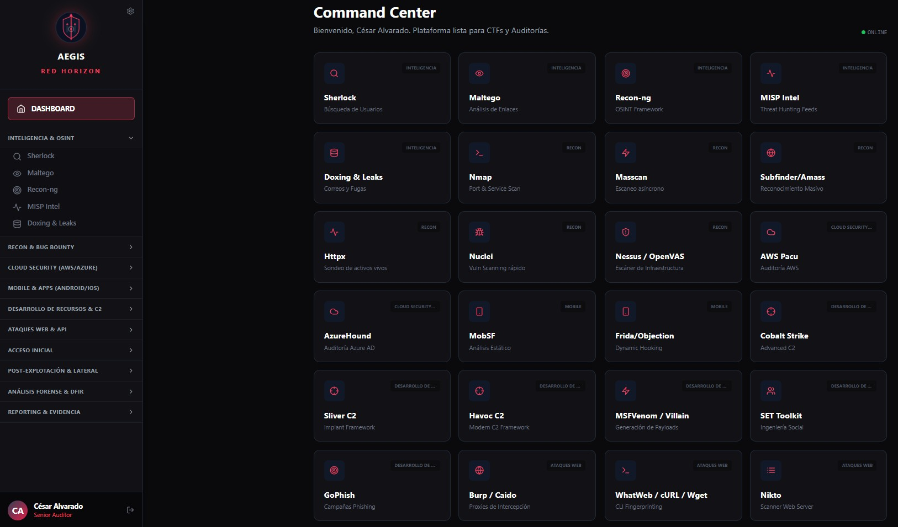
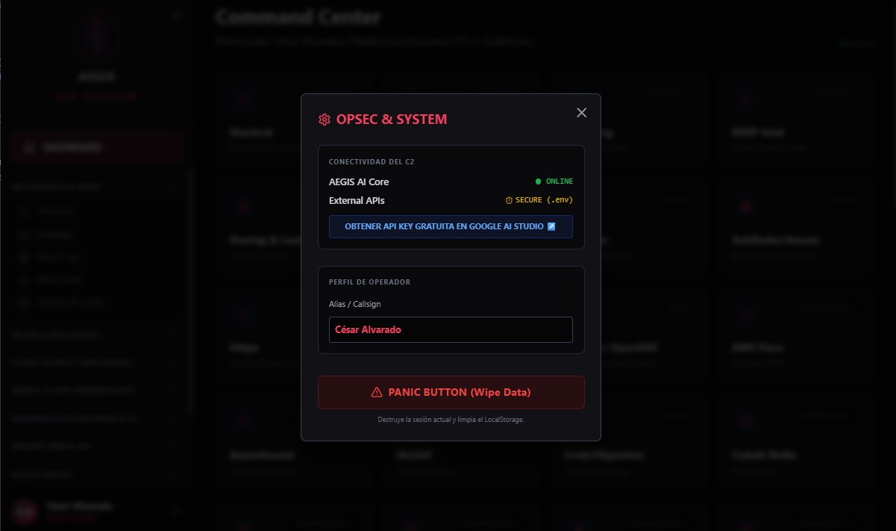
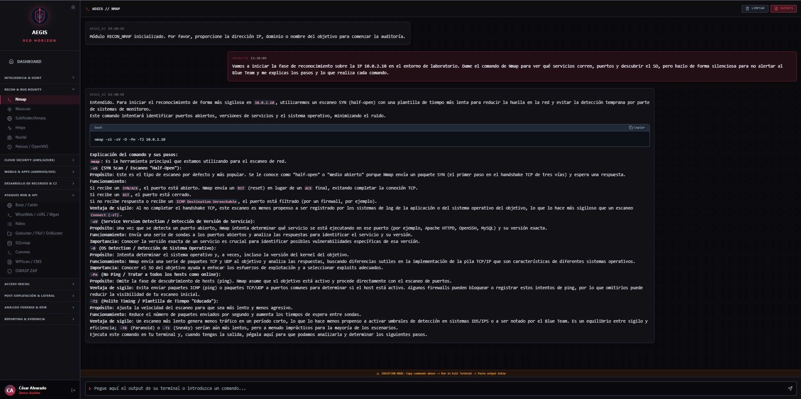
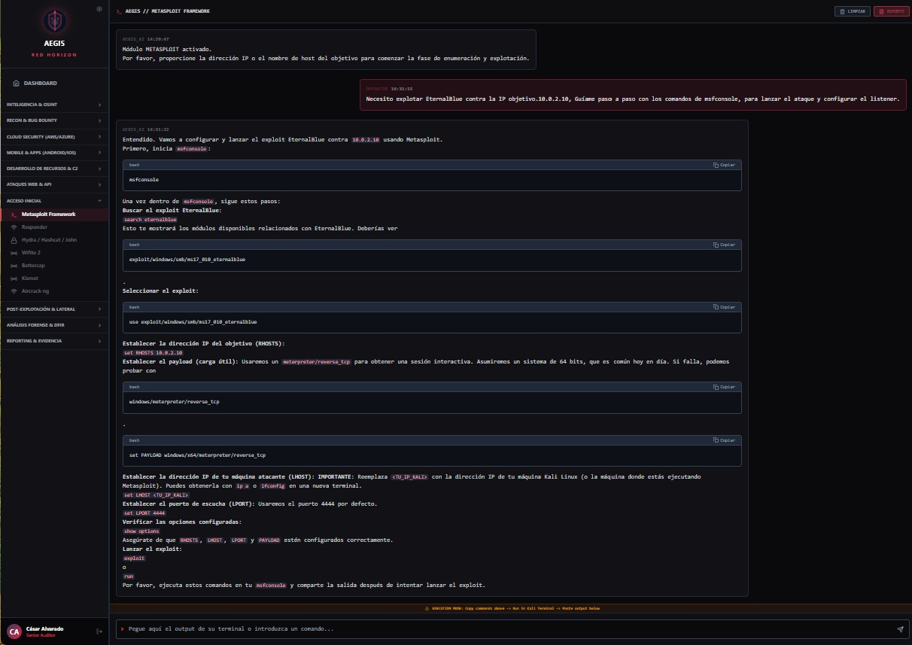
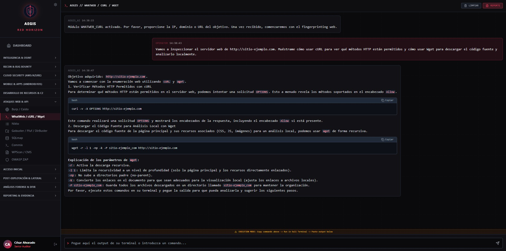

<div align="center">
  

  <h1> AEGIS: Red Horizon</h1>
  <p><strong>Plataforma de Operaciones de Red Team Asistida por IA (C2 Intelligence Core)</strong></p>

  <p>
    <a href="https://github.com/cwaly/AEGIS_RED_HORIZON/releases"></a>
    <a href="https://docker.com"></a>
    <a href="https://img.shields.io/badge/AI-Gemini%202.5%20Flash-purple"></a>
  </p>
  
  <p><i>Un "Cerebro Digital" C2 para la orquestación avanzada de auditorías ofensivas, CTFs y análisis forense.</i></p>
  <p><b>Creado por César Matute</b></p>
</div>

---

## 📖 Índice

- [Visión General](#-visión-general)
- [Arquitectura de Paneles](#-arquitectura-de-paneles)
- [Showcase / Interfaz](#-showcase--interfaz)
- [Capacidades del Arsenal](#-capacidades-del-arsenal)
- [Instalación y Despliegue](#-instalación-y-despliegue)
- [Solución de Problemas](#-solución-de-problemas-troubleshooting)
- [Documentación Oficial](#-documentación-oficial)
- [Aviso Legal y Ética](#️-aviso-legal-y-ética-operativa)

---

## 🔍 Visión General

**AEGIS: Red Horizon** es el núcleo ofensivo del ecosistema AEGIS. Es una suite C2 (Command & Control) diseñada para guiar al operador de seguridad a través de todas las fases del ciclo de vida de un ataque. 

La plataforma separa inteligentemente la lógica de orquestación y análisis (AEGIS AI Core) de la ejecución operativa (entornos como Kali Linux, Parrot, CSI Linux, entre otras distros de Hacking Ético), centralizando el flujo de trabajo en un panel de control multisesión de grado militar.

---

## 🏗️ Arquitectura de Paneles

La plataforma se divide en componentes clave diseñados para maximizar la fluidez del auditor:

* **Command Center (Dashboard):** El arsenal visual. Despliega más de 30 módulos categorizados por vector de ataque (Cloud, Web, Mobile, OSINT). Funciona como el punto de lanzamiento para cualquier operación.
* **Terminal Multisesión:** Una interfaz táctica aislada por herramienta. Permite ejecutar un escaneo en Nmap en una pestaña, mientras en otra se prepara un payload en Metasploit, manteniendo el hilo conversacional de la IA independiente para cada objetivo.
* **Panel OPSEC & System:** El centro de control de seguridad. Permite verificar el estado de conexión de las APIs externas, cambiar el *Callsign* (Alias) en tiempo real y ejecutar el **Panic Button**, un borrado de emergencia que destruye los datos locales y la memoria de la IA.
* **Generador de Reportes:** Motor que compila instantáneamente los hallazgos de una terminal activa en un documento estructurado, clasificando las vulnerabilidades (CVSS) y detallando la remediación, listo para exportar a PDF o Word.

---

## 📸 Showcase / Interfaz

### 1. Autenticación y Acceso Seguro

*Pantalla de acceso con política de Zero-Trust y OPSEC.*

### 2. Command Center (Arsenal)

*Cuadrícula de módulos desplegados listos para la operación.*

### 3. OPSEC & Integración de IA

*Panel de control de seguridad operativa, enlace directo para obtener la API y Panic Button.*

### 4. Terminal Multisesión Asistida por IA

*Generación de comandos para escaneos sigilosos y evasión de firewalls (Módulo Nmap).*


*Guía de explotación paso a paso y configuración de listeners (Módulo Metasploit / EternalBlue).*


*Perfilado de servidores web y extracción de código fuente (Módulo Web CLI).*

---

## ⚡ Capacidades del Arsenal

- **🧠 IA Táctica (Gemini 2.5):** Asistencia y guía paso a paso. Genera comandos precisos y analiza el *output* de la terminal sin alucinaciones.
- **🔄 Persistencia Multisesión:** Abre múltiples herramientas en paralelo. El C2 mantendrá el contexto de cada ataque en pestañas separadas.
- **🚨 OPSEC & Panic Button:** Arquitectura segura que lee credenciales desde `.env` (no en el navegador) y cuenta con un botón de borrado de emergencia de memoria (Wipe Data).
- **📚 CTI & Análisis:** Búsqueda en Exploit-DB (SearchSploit), Mapeo MITRE ATT&CK y calculadora de criticidad CVSS interactiva.
- **☁️ Cloud & Web Hacking:** Módulos para AWS (Pacu), AzureHound, Burp Suite, SQLmap y CLI Fingerprinting.
- **📱 Mobile Hacking:** Análisis de aplicaciones Android/iOS (MobSF, Frida).
- **🔍 Forense & DFIR:** Módulos dedicados para Autopsy, Volatility 3 (memoria) y Wireshark (red).
- **📂 Reportes Dinámicos:** Generación de informes profesionales multiformato estructurados por severidad.

---

## 🛠️ Instalación y Despliegue

### 🔑 Paso 0: Obtener la llave del Motor de IA (Requisito Indispensable)
AEGIS Red Horizon utiliza Gemini 2.5 como su núcleo analítico. Para que funcione, necesitas una API Key (Google ofrece un *Tier Gratuito* excelente para desarrolladores y auditores).
1. Entra a [Google AI Studio](https://aistudio.google.com/app/apikey) con tu cuenta de Google.
2. Haz clic en el botón azul **"Create API key"**.
3. Copia la clave generada. La usarás en el archivo `.env` en los pasos siguientes.

### Opción A: Docker (Recomendada 🐳)
La forma más limpia y profesional.

1. **Construir imagen:**
```bash
   docker build -t aegis-red-horizon .

2. Ejecutar contenedor:
    docker run -d -p 1337:1337 --env-file .env aegis-red-horizon

3. Acceso: Entra en tu navegador a http://localhost:1337

Opción B: Windows / Linux (Local)
1 Clonar el repositorio:
    git clone [https://github.com/cwaly/AEGIS_RED_HORIZON.git](https://github.com/cwaly/AEGIS_RED_HORIZON.git)
    cd AEGIS_RED_HORIZON

2 Configurar Clave (.env):

  - Crea un archivo .env en la raíz del proyecto.

  - Añade tu credencial: VITE_GEMINI_API_KEY=tu_clave_aqui

3 Instalar dependencias y Correr:
    npm install
    npm run dev

🔧 Solución de Problemas (Troubleshooting)

Problema                                  Solución
-----------------------------------------------------------------------------------------------------------------------
sh: 1: vite: not found (Linux/Kali)       Error de permisos. Ejecuta:
                                          rm -rf node_modules package-lock.json
                                          npm install
                                          npm run dev
-----------------------------------------------------------------------------------------------------------------------                                          
IA no responde / No pasa de "READY"       Asegúrate de que tu archivo se llame exactamente .env y reinicia el servidor 
                                          (Ctrl+C y luego npm run dev).
-----------------------------------------------------------------------------------------------------------------------
Botón del Pánico activado                 Si usaste el Panic Button, la caché se ha purgado. 
                                          Solo vuelve a ingresar tu alias para reconectar con el C2.

📘 Documentación Oficial
Para comprender la doctrina de uso, la filosofía de la arquitectura y el flujo del "Loop de Combate", consulta el manual operativo:

👉 LEER MANUAL DE OPERACIONES Y DOCTRINA (MANUAL.md)

⚠️ Aviso Legal y Ética Operativa
Esta herramienta ha sido desarrollada estrictamente para uso profesional en auditorías reales, entornos académicos, resolución de CTFs (Capture The Flag) y el estudio avanzado de la Ciberseguridad.

El propósito de AEGIS: Red Horizon es actuar como un facilitador que agiliza las 5 fases metodológicas del Pentesting:

Reconocimiento (Information Gathering): OSINT y mapeo de superficie.

Escaneo y Enumeración: Identificación de puertos, servicios y vulnerabilidades.

Explotación: Acceso inicial y compromiso del sistema.

Post-Explotación y Borrado de Huellas: Escalada de privilegios, persistencia, movimiento lateral y borrado de evidencias para no dejar rastros.

Reporte (Reporting & DFIR): Análisis forense y generación de evidencias documentales.

El uso de este software para escanear, auditar o atacar infraestructura, redes o sistemas de información sin el consentimiento previo, explícito y por escrito de sus propietarios es un delito.

La responsabilidad absoluta del uso de las técnicas, comandos e inteligencia generada por esta plataforma recae íntegramente en la persona que lo opera. El creador de este proyecto no asumen ninguna responsabilidad por daños directos o indirectos causados por el mal uso de esta herramienta.

*Fin del documento. Operar con precaución.*

<div align="center">
  <br>
  <h3>🕸️ <i>Y recuerda: ¡"Un gran poder conlleva una gran responsabilidad"!</i> 🕸️</h3>
  <br>
</div>