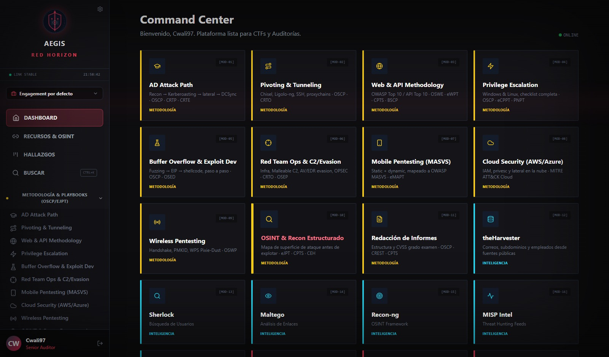
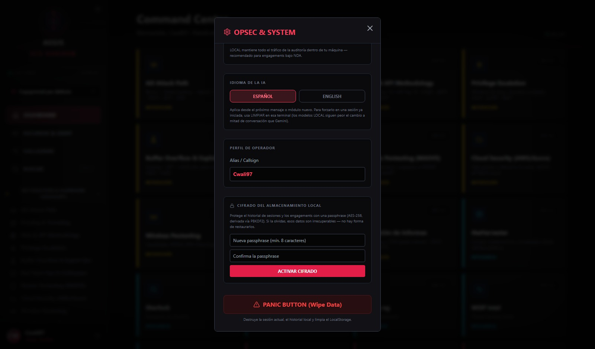
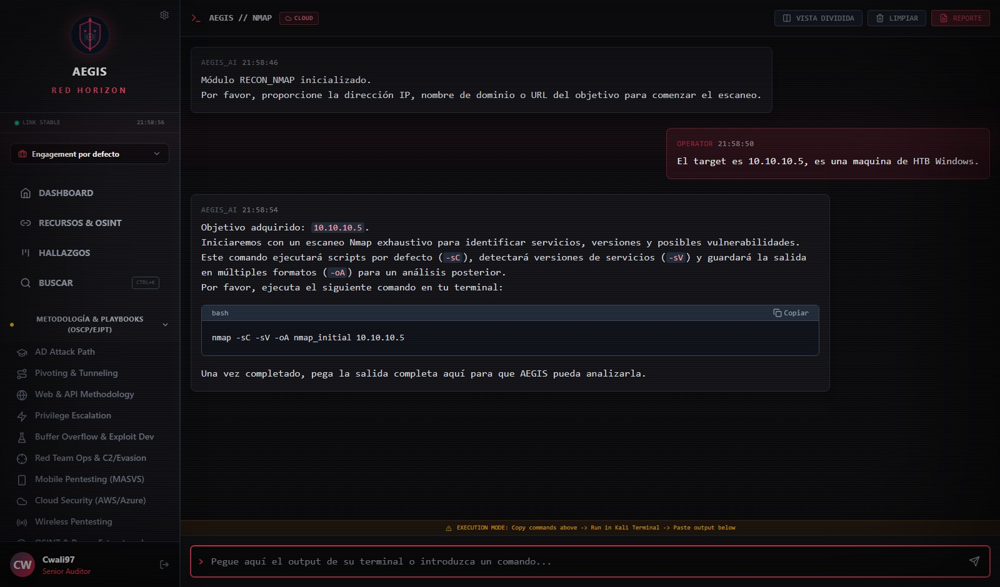
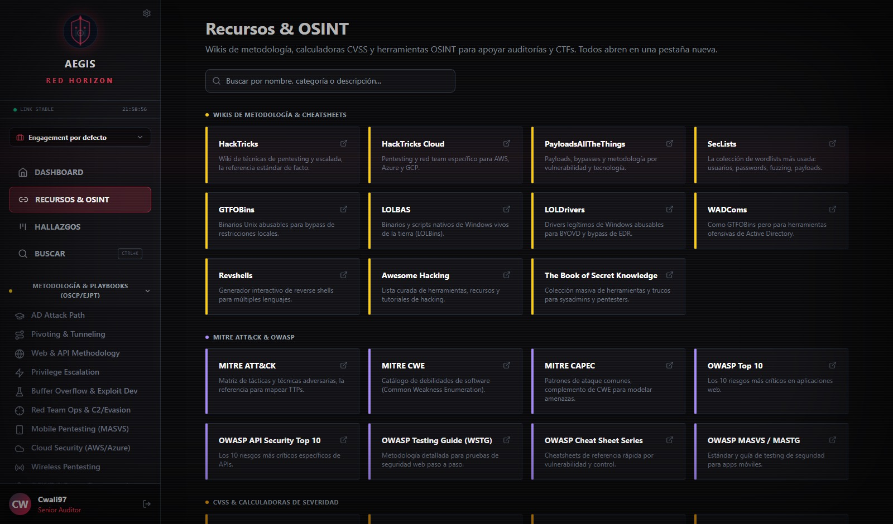
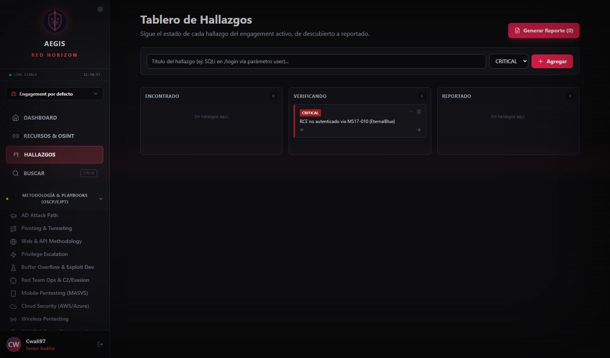
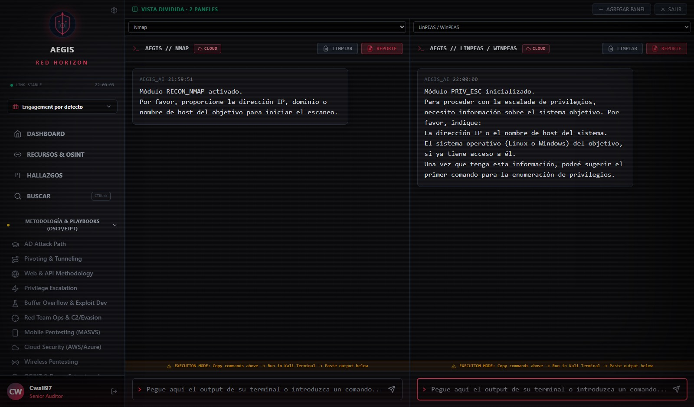

<div align="center">
  

  <h1> AEGIS: Red Horizon</h1>
  <p><strong>Plataforma de Operaciones de Red Team Asistida por IA (C2 Intelligence Core)</strong></p>

  <p>
    <a href="https://github.com/cwaly/AEGIS_RED_HORIZON/releases"></a>
    <a href="https://docker.com"></a>
    <a href="https://img.shields.io/badge/AI-Gemini%203.7%20Flash-purple"></a>
    <a href="https://ollama.com"></a>
  </p>
  
  <p><i>Un "Cerebro Digital" C2 para la orquestación avanzada de auditorías ofensivas, CTFs y análisis forense.</i></p>
  <p><b>Creado por César Matute</b></p>
</div>

---

## 📖 Índice

- [Visión General](#-visión-general)
- [Arquitectura de Paneles](#-arquitectura-de-paneles)
- [Showcase / Interfaz](#-showcase--interfaz)
- [Capacidades del Arsenal](#-capacidades-del-arsenal)
- [Instalación y Despliegue](#-instalación-y-despliegue)
- [Solución de Problemas](#-solución-de-problemas-troubleshooting)
- [Documentación Oficial](#-documentación-oficial)
- [Aviso Legal y Ética](#️-aviso-legal-y-ética-operativa)

---

## 🔍 Visión General

**AEGIS: Red Horizon** es el núcleo ofensivo del ecosistema AEGIS. Es una suite C2 (Command & Control) diseñada para guiar al operador de seguridad a través de todas las fases del ciclo de vida de un ataque. 

La plataforma separa inteligentemente la lógica de orquestación y análisis (AEGIS AI Core) de la ejecución operativa (entornos como Kali Linux, Parrot, CSI Linux, entre otras distros de Hacking Ético), centralizando el flujo de trabajo en un panel de control multisesión de grado militar.

---

## 🏗️ Arquitectura de Paneles

La plataforma se divide en componentes clave diseñados para maximizar la fluidez del auditor:

* **Command Center (Dashboard):** El arsenal visual. Despliega **62 módulos** categorizados por vector de ataque (Metodología, OSINT, Cloud, Web, Mobile, C2, Acceso Inicial, Post-Explotación, Forense). Funciona como el punto de lanzamiento para cualquier operación.
* **Workspaces por Engagement:** Cada target/cliente vive en su propio *engagement* aislado — sesiones de chat, hallazgos y contexto no se mezclan entre auditorías paralelas. Exportables/importables como JSON para backup o para moverlos a otra máquina.
* **Terminal Multisesión + Vista Dividida:** Interfaz táctica aislada por herramienta, con historial persistente por engagement. La **Vista Dividida** permite trabajar 2-3 módulos en paralelo (ej. recon + privesc + Burp) en paneles independientes, cada uno con su propia IA sin bloquearse entre sí.
* **Recursos & OSINT:** Panel de **83 enlaces curados** en 14 categorías — HackTricks, calculadoras CVSS, MITRE ATT&CK/OWASP, herramientas OSINT de personas/imágenes/infraestructura, write-ups de CTF, sandboxes de malware y más — cero dependencia de la IA, acceso directo.
* **Tablero de Hallazgos:** Kanban (Encontrado → Verificando → Reportado) para trackear hallazgos manualmente durante la auditoría, independiente del historial de chat. Un hallazgo "Reportado" se promueve directo a un reporte exportable sin volver a consultar a la IA.
* **Búsqueda Global (Ctrl+K):** Indexa el contenido de todas las sesiones de todos los engagements y módulos — encuentra en qué conversación mencionaste un CVE o una IP específica en segundos.
* **Panel OPSEC & System:** El centro de control de seguridad. Verifica el estado de conexión de ambos motores de IA, cambia el *Callsign* (Alias), activa el **cifrado opcional del almacenamiento local** (AES-256-GCM vía passphrase) y ejecuta el **Panic Button**, un borrado de emergencia que destruye los datos locales y la memoria de la IA.
* **Generador de Reportes:** Motor que compila los hallazgos de una terminal activa (o del Tablero de Hallazgos) en un documento estructurado, clasificando las vulnerabilidades (CVSS) y detallando la remediación — con evidencia fotográfica adjuntable por hallazgo, listo para exportar a PDF, Word o HTML.

---

## 📸 Showcase / Interfaz

### 1. Autenticación y Acceso Seguro

*Pantalla de acceso con política de Zero-Trust y OPSEC.*

### 2. Command Center (Arsenal)

*Cuadrícula de 62 módulos categorizados, con engagement activo, búsqueda global y navegación completa en el sidebar.*

### 3. OPSEC & Cifrado del Almacenamiento Local

*Conectividad de ambos motores de IA, selector Cloud/Local, y el nuevo cifrado opt-in AES-256 para proteger sesiones y hallazgos.*

### 4. Terminal Asistida por IA

*Generación de comandos y análisis de output en tiempo real, sin simulaciones (Módulo Nmap).*

### 5. Recursos & OSINT

*83 enlaces curados en 14 categorías: HackTricks, calculadoras CVSS, MITRE ATT&CK/OWASP, OSINT y más — sin depender de la IA.*

### 6. Tablero de Hallazgos

*Kanban Encontrado → Verificando → Reportado, promovible directo a un reporte exportable.*

### 7. Vista Dividida (Multi-Terminal)

*Dos o tres módulos trabajando en paralelo, cada uno con su propia sesión de IA independiente.*

---

## ⚡ Capacidades del Arsenal

- **🎓 11 Playbooks de Metodología (OSCP/eJPT/CRTO/OSED/eMAPT/OSWP/CEH/CREST):** Guías end-to-end paso a paso — AD Attack Path, Pivoting & Tunneling, Web & API Methodology, Privilege Escalation, Buffer Overflow & Exploit Dev, Red Team Ops & C2/Evasion, Mobile Pentesting, Cloud Security, Wireless Pentesting, OSINT & Recon Estructurado y Redacción de Informes — para afrontar certificaciones y CTFs con una metodología consistente, no solo comandos sueltos.
- **🧠 IA Táctica Dual (Cloud + Local):** Motor conmutable desde el panel OPSEC — **☁️ Gemini 3.7** en la nube, o **🖥️ Ollama en local (sin censura)** para auditorías bajo NDA donde el tráfico no puede salir de tu máquina. Genera comandos precisos y analiza el *output* de la terminal sin alucinaciones.
- **🗂️ Workspaces por Engagement:** Aísla sesiones, hallazgos y contexto por target/cliente. Exporta/importa un engagement completo como JSON para backup o para entregarlo a un cliente.
- **🪟 Vista Dividida:** Trabaja 2-3 módulos en paralelo con sesiones de IA independientes (el input de un panel nunca se bloquea por lo que responde otro).
- **🔍 Búsqueda Global (Ctrl+K):** Encuentra en segundos en qué engagement/módulo mencionaste un CVE, IP o cualquier texto entre todo tu historial.
- **📌 Tablero de Hallazgos:** Kanban Encontrado → Verificando → Reportado, con descripción/remediación editable por hallazgo. Se promueve directo a reporte sin volver a consultar a la IA.
- **🔗 Recursos & OSINT:** 83 enlaces curados en 14 categorías (metodología, CVSS, MITRE/OWASP, CVE/exploits, OSINT de personas/imágenes/infraestructura, CTF practice, write-ups, malware sandbox, cloud/mobile/wireless tools) — acceso directo, cero dependencia de la IA.
- **🔐 Cifrado Opt-in del Almacenamiento Local:** AES-256-GCM con clave derivada por PBKDF2 de una passphrase — protege sesiones, engagements y hallazgos guardados en el navegador para engagements bajo NDA.
- **🔒 API Gateway Backend:** Las credenciales (`GEMINI_API_KEY`, Ollama) viven exclusivamente en un backend Express — **nunca** se inyectan en el bundle del navegador.
- **🚨 OPSEC & Panic Button:** Panel de conectividad en tiempo real (Cloud/Local) y botón de borrado de emergencia de memoria (Wipe Data).
- **🎯 62 Módulos de Herramienta:** desde recon (Netdiscover, Nmap, Masscan, theHarvester, Subfinder/Amass) hasta post-explotación (Rubeus, Mimikatz, BloodHound/Impacket, CrackMapExec), C2 (Cobalt Strike, Sliver, Havoc, PowerShell Empire), forense (Autopsy, Volatility 3, Wireshark, Ghidra) y más — ver el detalle completo en el [Manual de Operaciones](./MANUAL.md).
- **📂 Reportes Dinámicos:** Generación de informes multiformato (PDF/Word/HTML) estructurados por severidad, con evidencia fotográfica adjuntable por hallazgo (subida o pegado directo con Ctrl+V).

---

## 🛠️ Instalación y Despliegue

### 🧠 Dos motores de IA: Cloud y Local (sin censura)

AEGIS Red Horizon corre sobre un **AI Gateway** propio (backend Express) que puede hablar con dos motores, conmutables en caliente desde el panel OPSEC & SYSTEM:

- **☁️ CLOUD — Gemini 3.7 Flash:** rápido, sin requisitos de hardware, ideal para CTFs. Requiere API Key de Google.
- **🖥️ LOCAL — Ollama (sin censura):** todo el tráfico de la auditoría se queda en tu máquina. Recomendado para engagements reales bajo NDA donde no puedes enviar datos del cliente a la nube. Requiere [Ollama](https://ollama.com) instalado y un modelo descargado.

**Ninguna API Key viaja jamás al navegador** — vive únicamente en el backend (`server/`), leída de `.env`.

### 🔑 Paso 0a: Motor Cloud — Gemini 3.7 (opcional si solo usarás LOCAL)
1. Entra a [Google AI Studio](https://aistudio.google.com/app/apikey) con tu cuenta de Google.
2. Haz clic en el botón azul **"Create API key"**.
3. Copia la clave generada. La usarás en el archivo `.env` en los pasos siguientes (variable `GEMINI_API_KEY`).

### 🖥️ Paso 0b: Motor Local — Ollama (opcional si solo usarás CLOUD)
1. Instala [Ollama](https://ollama.com/download).
2. Descarga el modelo por defecto — **Dolphin 3.0 (8B)**, sin censura, de la librería oficial de Ollama. Lo probamos en hardware de 12GB VRAM: responde en ~2-5s, no rechaza tareas de pentesting autorizado y no se cuelga:
   ```bash
   ollama pull dolphin3
   ```
3. Ajusta el modelo activo en `.env` con `OLLAMA_MODEL=<nombre-del-modelo>` en cualquier momento — no requiere tocar código. Alternativas que también funcionan bien: `llama3.1:8b` (más "neutro", no específicamente sin censura) o `dolphin-mixtral` (más grande, más capacidad, requiere más VRAM/RAM).

   ⚠️ **Nota de compatibilidad:** evitamos recomendar WhiteRabbitNeo — probamos sus quantizaciones GGUF de la comunidad (13B y 7B) y ambas se colgaron generando indefinidamente, porque su Modelfile no trae configurado un *stop-token*. Si quieres experimentar con otros modelos "uncensored", prefiere los de la librería oficial de Ollama (como `dolphin3`) sobre quantizaciones sueltas de la comunidad.

### Opción A: Docker (Recomendada 🐳)
La forma más limpia y profesional.

1. **Construir imagen:**
```bash
   docker build -t aegis-red-horizon .

2. Ejecutar contenedor:
    docker run -d --name aegis-red-horizon --restart unless-stopped -p 1337:1337 --env-file .env -e OLLAMA_BASE_URL=http://host.docker.internal:11434 aegis-red-horizon

    ⚠️ Si usas el motor LOCAL (Ollama corriendo en tu máquina, fuera del contenedor), necesitas el `-e OLLAMA_BASE_URL=...` de arriba: dentro del contenedor `127.0.0.1` apunta al propio contenedor, no a tu host. En Linux nativo (no Docker Desktop) puede que además necesites `--add-host=host.docker.internal:host-gateway`. Si solo usarás el motor CLOUD (Gemini), puedes omitir esa variable.

    ⚠️ `--restart unless-stopped` hace que el contenedor se reinicie solo si Docker Desktop/WSL2 lo mata en segundo plano (código de salida 137, común tras suspender la máquina o reiniciar Docker Desktop) — evita tener que levantarlo a mano cada vez.

3. Acceso: Entra en tu navegador a http://localhost:1337

Opción B: Ejecución Local Automatizada (Windows / Linux)
El proyecto incluye scripts de inicialización que instalan las dependencias (si es la primera vez), levantan el servidor y 
abren tu navegador de forma automática.

1 Clonar el repositorio:
    git clone https://github.com/cwaly/AEGIS_RED_HORIZON.git
    cd AEGIS_RED_HORIZON

2 Configurar Clave (.env):

  - Crea un archivo .env en la raíz del proyecto.

  - Añade las variables que necesites (todas server-side, ninguna llega al navegador):
    ```
    GEMINI_API_KEY=tu_clave_aqui
    OLLAMA_BASE_URL=http://127.0.0.1:11434
    OLLAMA_MODEL=dolphin3
    ```

3 Lanzar la plataforma:

  - En Windows: Haz doble clic sobre el archivo start_aegis.bat o ejecútalo desde tu consola.
    Crear acceso directo al escritorio (Opcional)
    Colocar el icono al acceso directo al escritorio, con la siguiente ruta del archivo (Unidad donde este alojada el 
    repositorio descargado de GitHun\AEGIS_RED_HORIZON\public\AEGIS_Red_Horizon.ico)

  - En Linux / macOS: Otorga permisos de ejecución al script bash y lánzalo con los siguientes comandos:
    chmod +x start_aegis.sh
    ./start_aegis.sh

    Crear un lanzador, acceso directo al escritorio (Opcional)
    Colocar el icono al acceso directo al escritorio, con la siguiente ruta del archivo (Unidad donde este alojada el 
    repositorio descargado de GitHun\AEGIS_RED_HORIZON\public\AEGIS_Red_Horizon.ico)

🔧 Solución de Problemas 

Problema                                  Solución
----------------------------------------------------------------------------------------------------------------------------------
sh: 1: vite: not found (Linux/Kali)       Error de permisos. Ejecuta los siguientes comandos en orden:
                                          rm -rf node_modules package-lock.json
                                          npm install
                                          npm run dev
----------------------------------------------------------------------------------------------------------------------------------                               
IA no responde / No pasa de "READY"       Asegúrate de que tu archivo se llame exactamente .env y reinicia el servidor 
                                          (Ctrl+C y luego npm run dev).
----------------------------------------------------------------------------------------------------------------------------------
Motor LOCAL da timeout / no responde      Revisa que "ollama serve" esté corriendo (curl http://127.0.0.1:11434/api/tags).
                                          Si un modelo se queda colgado, ejecuta "ollama stop <modelo>". Si el problema
                                          persiste con una quantización concreta, cambia OLLAMA_MODEL en .env por otra
                                          (p. ej. dolphin3, que es el default probado, sin censura y estable).
----------------------------------------------------------------------------------------------------------------------------------
start_aegis no arranca / navegador        Los scripts detectan si los puertos 1337 o 4000 ya están ocupados (p. ej. una
abre una página rota o de otro proyecto   instancia anterior que no cerró bien) y te muestran el proceso exacto que los
                                          tiene tomados, con el comando para liberarlo (taskkill /F /PID en Windows,
                                          kill en Linux/macOS). Ciérralo y vuelve a lanzar el script.
----------------------------------------------------------------------------------------------------------------------------------
Botón del Pánico activado                 Si usaste el Panic Button, la caché se ha purgado. 
                                          Solo vuelve a ingresar tu alias para reconectar con el C2.
----------------------------------------------------------------------------------------------------------------------------------
Olvidé mi passphrase de cifrado           No hay recuperación posible (es cifrado real) — en la pantalla de desbloqueo,
                                          usa "¿Olvidaste tu passphrase? Borrar datos cifrados". Borra solo las sesiones/
                                          engagements/hallazgos cifrados y te devuelve el acceso a la app; el resto de tu
                                          config (alias, idioma, motor de IA) no se toca.
----------------------------------------------------------------------------------------------------------------------------------
El contenedor Docker no arrancó solo      Docker Desktop en Windows no siempre respeta `--restart unless-stopped` tras un
tras reiniciar la máquina                 reinicio completo del SO (a diferencia de solo reiniciar Docker Desktop). Corre
                                          "docker start aegis-red-horizon" manualmente, o activa "Start Docker Desktop
                                          when you sign in" en Settings → General.

📘 Documentación Oficial
Para comprender la doctrina de uso, la filosofía de la arquitectura y el flujo del "Loop de Combate", consulta el 
manual operativo:

👉 LEER MANUAL DE OPERACIONES Y DOCTRINA (MANUAL.md)

⚠️ Aviso Legal y Ética Operativa
Esta herramienta ha sido desarrollada estrictamente para uso profesional en auditorías reales, entornos académicos, 
resolución de CTFs (Capture The Flag) y el estudio avanzado de la Ciberseguridad.

El propósito de AEGIS: Red Horizon es actuar como un facilitador que agiliza las 5 fases metodológicas del Pentesting:

Reconocimiento (Information Gathering): OSINT y mapeo de superficie.

Escaneo y Enumeración: Identificación de puertos, servicios y vulnerabilidades.

Explotación: Acceso inicial y compromiso del sistema.

Post-Explotación y Borrado de Huellas: Escalada de privilegios, persistencia, movimiento lateral y borrado de evidencias 
para no dejar rastros.

Reporte (Reporting & DFIR): Análisis forense y generación de evidencias documentales.

El uso de este software para escanear, auditar o atacar infraestructura, redes o sistemas de información sin el consentimiento 
previo, explícito y por escrito de sus propietarios es un delito.

La responsabilidad absoluta del uso de las técnicas, comandos e inteligencia generada por esta plataforma recae íntegramente 
en la persona que lo opera. El creador de este proyecto no asumen ninguna responsabilidad por daños directos o indirectos 
causados por el mal uso de esta herramienta.


Fin del documento. Operar con precaución.

🕸️ Y recuerda: ¡"Un gran poder conlleva una gran responsabilidad"!🕸️